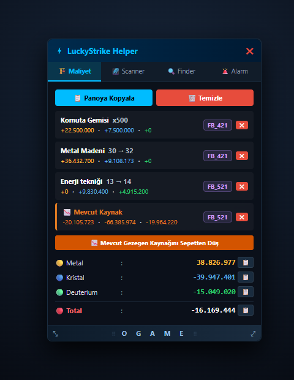
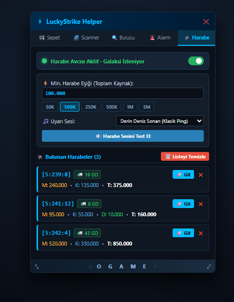
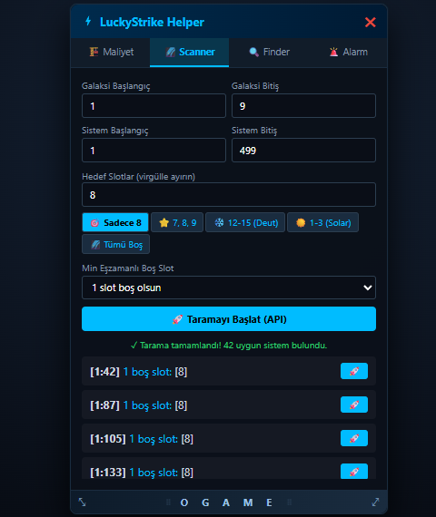
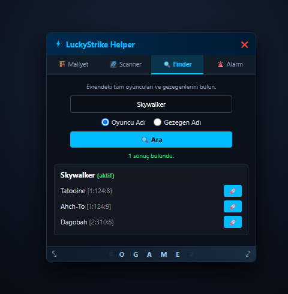
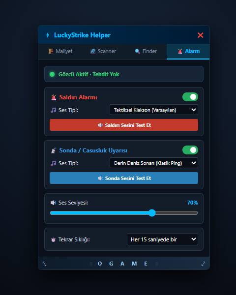

# ⚡ LuckyStrike OGame Helper (v7.1)

[English](#-english-description) | [Türkçe](#-türkçe-açıklama)

---

## 🇹🇷 Türkçe Açıklama

**LuckyStrike OGame Helper**, OGame oyuncuları için günlük imparatorluk yönetimini, hammadde planlamasını, filo nakliye hesaplamalarını ve harabe takibini kolaylaştırmak üzere tasarlanmış, **Gameforge oyun kurallarına tam uyumlu** gelişmiş bir kullanıcı arayüzü asistanıdır (**Chrome / Edge Extension - Manifest V3** ve **Tampermonkey Userscript**).

### 🛡️ Gameforge & OGame Oyun Kurallarına Uyumluluk
LuckyStrike OGame Helper, **Gameforge Kullanım Şartları ve Oyun Kuralları (Kural 5: Otomasyon ve Bot Politikası)** gözetilerek geliştirilmiştir:
- **Pasif Dinleme Mimarisi:** Eklenti sunucuya arka planda otomatik veya periyodik istekler göndermez, sunucu trafiği oluşturmaz.
- **Otomasyon / Bot İçermez:** Filoları otomatik göndermez, bina veya araştırma emri vermez. Kaynak doldurma gibi kolaylaştırıcı işlemler yalnızca **oyuncunun doğrudan tıklamasıyla** form alanlarına yazılır; son onay ve gönderim kontrolü tamamen oyuncuya aittir.
- **Resmi Gameforge API Kullanımı:** Evren taraması ve oyuncu arama modülleri, Gameforge tarafından kamuya açık olarak sağlanan resmi XML API altyapısını (`/api/universe.xml`, `/api/players.xml`) kullanır.
- **İstemci Taraflı ve Gizlilik Odaklı:** Hiçbir kullanıcı verisi veya oyun bilgisi harici sunuculara aktarılmaz, tüm tercihler sadece yerel tarayıcı belleğinizde saklanır.

---

### 🌟 Öne Çıkan Özellikler

#### 1. 🏗️ Maliyet Sepeti & Çoklu Kademe Hesabı

  

- Herhangi bir bina veya araştırma detayına tıklandığında `[ − ] [ +N ] [ + ]` seçimi ve tek tıkla sepete ekleme.
- **Resmi Gameforge LFMaster Tablosu:** 4 ırkın (Rock'tal, İnsan, Mecha, Kaelesh) 48 binası ve 72 araştırması dahil tüm binaların çoklu kademe maliyetlerini tam doğrulukla hesaplar.
- **Mevcut Kaynağı Düş:** Gezegendeki Metal, Kristal ve Deuterium'u sepetten düşerek net açığı gösterir.
- **Nakliye Filosu İhtiyacı:** Kalan açık için gereken Küçük Nakliye (KN) ve Büyük Nakliye (BN) sayısını anında hesaplar.
- **Filoya Otomatik Doldurma:** Filo gönderme ekranında tek tıkla gerekli gemi sayısını seçer ve kaynak kutularını doldurur.

---

#### 2. 🛰️ Gerçek Zamanlı Harabe Avcısı (Debris Hunter)

  

- Galakside gezinirken ekrandaki harabeleri anında yakalar ve listeler.
- 16. Slot (Sonsuz Uzaklar / Keşif Harabesi) tam desteği.
- Belirlenen eşik (örn: 100K, 500K, 1M) üzerindeki harabeler için sesli sonar uyarısı.
- Gerekli Geri Dönüşümcü (GD) miktarını otomatik hesaplar.

---

#### 3. 🌌 Galaxy Scanner & 🔍 Player Finder

  
  &nbsp;&nbsp;&nbsp;&nbsp;
  

- Boş slotları, grupça ışınlanma yapılabilecek sistemleri ve oyuncu/gezegen koordinatlarını saniyeler içinde listeler.

---

#### 4. 🚨 Saldırı & Sonda Sesli Alarmı (Threat Alarm)

  

- Gelen saldırı veya casusluk hareketlerini OGame'in kendi arayüzü üzerinden anlık yakalar.
- Web Audio API ile dahili siren/sonar sesleri ve masaüstü bildirimleri üretir.

---

## 🇬🇧 English Description

**LuckyStrike OGame Helper** is an advanced, lightweight browser assistant (**Chrome / Edge Extension - Manifest V3** & **Tampermonkey Userscript**) designed for OGame players to streamline daily empire management, resource planning, cargo calculation, and debris tracking while strictly following **Gameforge Fair-Play Rules**.

### 🛡️ Gameforge & OGame Rules Compliance
LuckyStrike OGame Helper is developed in full accordance with **Gameforge Terms & Conditions (Rule 5: Automation & Bot Policy)**:
- **Passive Architecture:** The extension never generates automated or periodic background requests to the game servers.
- **Strictly Non-Automated:** No automated fleet dispatches, building queues, or script loops. Autofill actions only execute upon **explicit player click**; the final command confirmation always remains with the player.
- **Official Gameforge Public APIs:** Galaxy scanning and player searches strictly utilize official public XML APIs (`/api/universe.xml`, `/api/players.xml`) provided for tool developers.
- **Client-Side & Privacy-First:** No personal data or credentials are ever collected or sent to external servers. All settings remain strictly in local browser storage.

---

### 🌟 Key Features

#### 1. 🏗️ Resource Cost Cart & Multi-Level Calculation
- Multi-level selector `[ − ] [ +N ] [ + ]` directly in technology detail popups.
- Full support for all standard buildings, researches, and Lifeform structures across all 4 races (Human, Rock'tal, Mecha, Kaelesh).
- **Deduct Live Resources:** Subtract currently stored resources with a single click to see exact deficit/surplus.
- **Cargo Fleet Calculator:** Automatically computes exact Small Cargo (KN) and Large Cargo (BN) ships needed based on current Hyperspace Technology.
- **Fleet Auto-Fill:** Populate ship counts and cargo inputs on fleet dispatch screens with one click.

#### 2. 🛰️ Real-Time Debris Field Scanner
- Highlights and logs debris fields in real-time as you browse the galaxy view.
- 16th slot (Expedition / Endless Expanse) debris detection.
- Configurable resource threshold alerts with realistic submarine sonar sounds.
- Automatically calculates required Recyclers.

#### 3. 🌌 Galaxy Scanner & 🔍 Player Finder
- Instantly scan 9 galaxies for empty slots (e.g. slot 8) or find player colonies via official APIs.

#### 4. 🚨 Threat Alarm & Tactical Audio
- In-game tactical sirens and sonar alerts when hostile attacks or spy probes are incoming.
- Web Notifications API desktop alerts even when the game tab is minimized.

---

## 🚀 Kurulum / Installation

### Chrome & Microsoft Edge (Recommended 🌟)
1. İndirin / Download: [`luckystrike-ogame-helper-v7.1.zip`](https://github.com/kadirersoy/luckystrike-ogame-helper/releases/latest)
2. Tarayıcıda eklentiler sayfasına gidin / Open extensions page:
   - **Chrome:** `chrome://extensions`
   - **Edge:** `edge://extensions`
3. **"Geliştirici Modu" (Developer Mode)** seçeneğini açın.
4. ZIP'ten çıkardığınız klasörü **"Paketlenmemiş öğe yükle" (Load unpacked)** butonuyla seçin.

### Tampermonkey Userscript
1. Tampermonkey panelinde yeni betik oluşturun.
2. [`luckystrike_ogame_helper.js`](luckystrike_ogame_helper.js) içeriğini yapıştırıp kaydedin.

---

## 📝 Sürüm Geçmişi / Changelog

### v7.1
- **🛡️ 100% Pasif Dinleme:** Periyodik arka plan ağ sorguları kaldırılarak OGame'in kendi DOM ve AJAX olaylarına bağlandı.
- **🎨 Yeni Metalik OGame Logosu:** Karanlık uzay teması ve metalik gümüş OGame tipografisi.
- **🌐 Çift Dil (TR/EN) & Kural Uyumluluğu Rehberi:** Detaylı fair-play ve kural uygunluğu dökümantasyonu eklendi.

### v7.0
- **Dinamik Gemi Kapasiteleri:** Hiperuzay Tekniği (ID 114) bonusları otomatik hesaba katıldı.
- **Akıllı 3'lü Filo Yükleme Butonu:** Otomatik, KN ve BN seçimli tek tıkla yükleme entegrasyonu.
- **Net Kaynak Dengeleme:** Pozitif maliyetler ve negatif mevcut kaynaklar ayrı ayrı analiz edildi.
