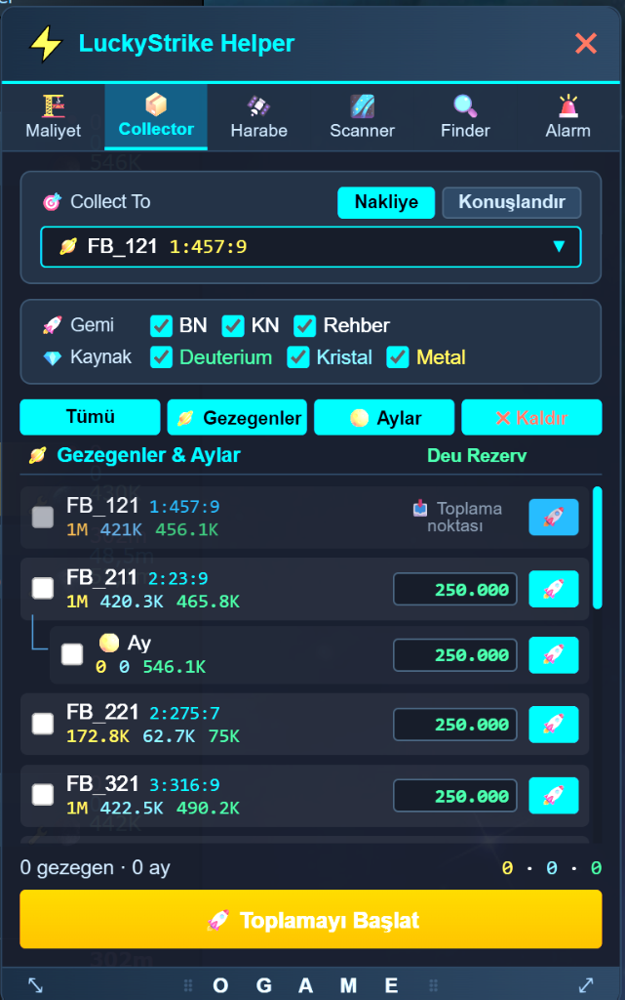

# ⚡ LuckyStrike OGame Helper (v8.0)

[English](#-english-description) | [Türkçe](#-türkçe-açıklama)

---

## 🇹🇷 Türkçe Açıklama

**LuckyStrike OGame Helper**, OGame oyuncuları için günlük imparatorluk yönetimini, hammadde planlamasını, filo nakliye hesaplamalarını ve bilgi takibini kolaylaştırmak üzere tasarlanmış, **Gameforge oyun kurallarına tam uyumlu** bir kullanıcı arayüzü asistanıdır (**Chrome / Edge Extension - Manifest V3**).

### 🛡️ Gameforge & OGame Oyun Kurallarına Uyumluluk
LuckyStrike OGame Helper, **Gameforge Kullanım Şartları ve Oyun Kuralları (Kural 5: Otomasyon ve Bot Politikası)** titizlikle gözetilerek geliştirilmiştir:
- **Sadece Oyuncu Başındayken ve Pasif Çalışır:** Eklenti arka planda kendi kendine sunucuya istek atmaz. Bilgi takibi ve güncellemeler, yalnızca **oyuncu bilgisayar başındayken**, sayfalar arasında gezinirken veya tarayıcı sekmesi güncellendiğinde ekrana gelen verileri okur.
- **Otomasyon / Bot İçermez:** Filoları arka planda sessizce göndermez, bina/araştırma emri vermez. Kaynak doldurma ve filo hazırlama gibi kolaylaştırıcı işlemler yalnızca **oyuncunun bizzat butona tıklamasıyla** form alanlarına yazılır; son onay, gönderme (Space veya butona tıklama) ve karar kontrolü tamamen oyuncuya aittir.
- **Resmi Gameforge API Altyapısı:** Evren analizi ve oyuncu arama modülleri, Gameforge'un eklenti ve araç geliştiricileri için kamuya açık olarak sağladığı resmi XML API altyapısını (`/api/universe.xml`, `/api/players.xml`) kullanır.
- **İstemci Taraflı ve Gizlilik Odaklı:** Hiçbir kullanıcı verisi veya oyun bilgisi harici sunuculara aktarılmaz, tüm tercihler sadece yerel tarayıcı belleğinizde saklanır.

---

### 🌟 Oynanışı Kolaylaştıran Özellikler

#### 1. 🏗️ Maliyet Sepeti & Çoklu Kademe Hesabı

  

- Bina veya araştırma detayına tıklandığında `[ − ] [ +N ] [ + ]` seçimi ve tek tıkla sepete ekleme.
- **Resmi Gameforge LFMaster Tablosu:** 4 ırkın (Rock'tal, İnsan, Mecha, Kaelesh) 48 binası ve 72 araştırması dahil tüm binaların çoklu kademe maliyetlerini tam doğrulukla hesaplar.
- **Mevcut Kaynağı Düş:** Gezegendeki kaynakları sepetten düşerek net açığı gösterir.
- **Nakliye Filosu İhtiyacı:** Kalan açık için gereken Küçük Nakliye (KN) ve Büyük Nakliye (BN) sayısını anında hesaplar.
- **Akıllı Filo Gönderimi (Space Desteği):** Sepetteki eksik kaynakları ve hedef koordinatları otomatik yükler, 2. adıma geçer ve tek tuşla (`Space`) yola çıkarır.

---

#### 2. 📦 Maden Toplayıcı Asistanı (Resource Collector)

  

- **İmparatorluk Çapında Pratik Toplama:** Seçilen tüm gezegen ve aylardan belirlenen merkez noktaya (gezegen, ay veya manuel koordinat) madenleri sıra sıra toplar.
- **Güvenli Rezerv Koruma:** Her gezegen için harcanmayacak minimum Deuterium rezervi tanımlanabilir.
- **Akıllı Filo & Görev Seçimi:** Büyük Nakliye (BN), Küçük Nakliye (KN) ve Rehber gemi dağılımı otomatik yapılır; **Nakliye** veya **Konuşlandır** görevi belirlenebilir.
- **Yüzen Bilgi Paneli & Tek Tuşla Gönderim:** Ekranın üstünde çıkan bilgi panelinden rota, taşınan madenler izlenebilir; `Space` tuşu ile sıra sıra filolar güvenle gönderilebilir.
- **Hata Toleransı (Tekrarla Butonu):** Bağlantı gecikmesi veya sayfa yükleme aksaklıklarında sırayı bozmadan adımı yeniden deneme imkanı.

---

#### 3. 🛰️ Harabe Alanı Takipçisi (Debris Tracker)

  

- **Sadece Galakside Gezinirken Okur:** Oyuncu galaksi sayfasında gezinirken, ekranda o an görüntülenen harabeleri listeye derler ve gözden kaçmasını önler.
- 16. Slot (Sonsuz Uzaklar / Keşif Harabesi) bilgilerini listeye dahil eder.
- Oyuncunun belirlediği eşiğin üzerindeki harabeler için sesli uyarı imkanı sunar.
- Toplam kaynağa göre gereken Geri Dönüşümcü (GD) sayısını ekranda hesaplayarak gösterir.

---

#### 4. 🌌 Galaxy Scanner (Boş Slot & Sistem Arayıcı)

  

- Resmi Gameforge evren verisini kullanarak boş slotları ve grupça ışınlanma yapılabilecek uygun güneş sistemlerini listeler.
- Hedef slot filtreleme (Slot 8, 7-8-9, Deut slotları vb.) ile arama kolaylığı sağlar.
- Sonuçların yanındaki buton ile doğrudan galaksi sayfasına pratik yönlendirme sunar.

---

#### 5. 🔍 Player Finder (Oyuncu & Gezegen Arama)

  

- Resmi API üzerinden oyuncuların kolonilerini veya aradığınız gezegen adlarının koordinatlarını listeler.
- İttifak ve oyuncu koordinatlarını harita üzerinde kolayca takip etmeye yardımcı olur.

---

#### 6. 🚨 Saldırı & Sonda Bildirim Desteği (Threat Alert)

  

- **Yalnızca Oyun Açıkken ve Ekran Güncellendiğinde:** Sayfa yenilendiğinde veya OGame'in kendi üst barındaki etkinlik kutusu güncellendiğinde ekrandaki durumu okur.
- Oyuncunun açık olan sekmesinde gözden kaçırmaması için dahili sesli ve masaüstü bildirim kolaylığı sunar.

---

## 🇬🇧 English Description

**LuckyStrike OGame Helper** is an advanced browser assistant (**Chrome / Edge Extension - Manifest V3**) designed for OGame players to assist with daily empire management, resource planning, cargo calculation, and information tracking while strictly following **Gameforge Fair-Play Rules**.

### 🛡️ Gameforge & OGame Rules Compliance
LuckyStrike OGame Helper is engineered with strict adherence to **Gameforge Terms & Conditions (Rule 5: Automation & Bot Policy)**:
- **Active Player Only & Passive Reading:** The extension never sends automated background requests. It only reads screen data when the player is actively playing, navigating pages, or when browser tabs update.
- **Strictly Non-Automated:** No automated background fleet dispatches or bot cycles. Autofill helpers populate inputs upon **explicit player click**; the final command, confirmation, and launch decisions always remain in the player's hands.
- **Official Gameforge Public APIs:** Galaxy and player analysis modules utilize official public XML APIs (`/api/universe.xml`, `/api/players.xml`) provided for tool developers.
- **Client-Side & Privacy-First:** No personal data or credentials are ever collected or transmitted. All preferences remain strictly in your local browser storage.

---

### 🌟 Gameplay Convenience Features

#### 1. 🏗️ Resource Cost Cart & Multi-Level Calculation
- Multi-level selector directly in technology detail popups.
- Full support for all buildings, researches, and Lifeform structures across all 4 races.
- Deduct currently stored resources to calculate exact deficits.
- Computes Small Cargo (KN) and Large Cargo (BN) requirements dynamically.
- Modernized fleet auto-load with Step 2 navigation and `Space` key dispatch.

#### 2. 📦 Resource Collector Assistant
- Gather resources across empire planets/moons to a designated target (planet, moon, or manual coordinates).
- Reserve deuterium protection for each colony.
- Multi-ship support (Large Cargo, Small Cargo, Pathfinder) and mission selection (Transport / Deploy).
- Floating HUD banner with fleet summary and single-stroke `Space` sending.
- Step retry button for handling slow network or page loads without disrupting queue order.

#### 3. 🛰️ Debris Field Tracker
- **Active Navigation Only:** Organizes and lists debris fields visible on screen as the player browses galaxy pages.
- Includes Slot 16 (Expedition / Endless Expanse) debris info.
- Optional audio notification for debris fields above user-selected thresholds.
- Calculates required Recyclers on screen.

#### 4. 🌌 Galaxy Scanner (Empty Slot Locator)
- Analyzes official universe data to find empty slots or suitable systems for colonization/relocation.
- Target slot filters (Slot 8, 7-8-9, etc.) for streamlined search.

#### 5. 🔍 Player Finder (Colony Locator)
- Displays player colony lists and coordinates via official public APIs.

#### 6. 🚨 In-Game Threat Alert Assistant
- **Active Screen Updates Only:** Reads threat status when pages are loaded or when the game's native event header updates.
- Provides optional audio and desktop notifications to prevent missing incoming activity while playing.

---

## 🚀 Kurulum / Installation

### Chrome & Microsoft Edge
1. İndirin / Download: [`luckystrike-ogame-helper-v8.0.zip`](https://github.com/kadirersoy/luckystrike-ogame-helper/releases/latest)
2. Tarayıcıda eklentiler sayfasına gidin / Open extensions page:
   - **Chrome:** `chrome://extensions`
   - **Edge:** `edge://extensions`
3. **"Geliştirici Modu" (Developer Mode)** seçeneğini açın.
4. ZIP'ten çıkardığınız klasörü **"Paketlenmemiş öğe yükle" (Load unpacked)** butonuyla seçin.

---

## 📝 Sürüm Geçmişi / Changelog

### v8.0
- **📦 Maden Toplayıcı Asistanı (Resource Collector):** Tüm imparatorluk kolonilerinden (gezegen veya ay) tek bir hedef noktaya pratik maden toplama asistanı eklendi. Gezegen listesi, rezerv koruma, BN / KN / Rehber gemi dağılımı, Nakliye / Konuşlandır görev seçenekleri ve manuel hedef koordinat desteği.
- **⌨️ Tek Tuşla Filo Gönderimi (Space Tuşu) & Yüzen Bilgi Paneli:** Toplayıcı ve Maliyet sepetinde rota, yüklenen kaynaklar ve filo detaylarını üst yüzen banner'da göstererek Space tuşuyla tek hamlede güvenli filo gönderimi sağlandı.
- **🔄 Adım Tekrarlama (Retry) & Bağlantı Hata Koruması:** Sayfa veya bağlantı gecikmelerinde sırayı bozmadan adımı sıfırdan yeniden deneme butonu eklendi.
- **🏗️ Maliyet Sepeti Filo Entegrasyonu Yenilendi:** Eksik bina/araştırma maliyetleri için gemi seçimi, 2. adıma otomatik geçiş ve ambar doldurma akışı modernize edildi.
- **📑 Optimize Sekme Dizilimi:** Sekmeler kullanım ergonomisine göre yeniden dizildi: *Maliyet, Collector, Harabe, Scanner, Finder, Alarm*.

### v7.1
- **🛡️ Oyun Kurallarına Tam Uyum:** Arka plan ağ istekleri kaldırılarak yalnızca oyuncunun sekme ve sayfa yenileme anlarında çalışan pasif mimariye geçildi.
- **🎨 Yeni Metalik OGame Logosu:** Karanlık uzay teması ve metalik gümüş OGame tipografisi.
- **🌐 Çift Dil (TR/EN) & Oynanış Kolaylığı Rehberi:** Modüller ayrıştırıldı, oynanış kolaylaştırıcı amaçlar netleştirildi.

### v7.0
- **Dinamik Gemi Kapasiteleri:** Hiperuzay Tekniği bonusları otomatik hesaba katıldı.
- **Akıllı 3'lü Filo Yükleme Butonu:** Otomatik, KN ve BN seçimli form doldurma desteği.
- **Net Kaynak Dengeleme:** Pozitif maliyetler ve negatif mevcut kaynaklar ayrı ayrı analiz edildi.
